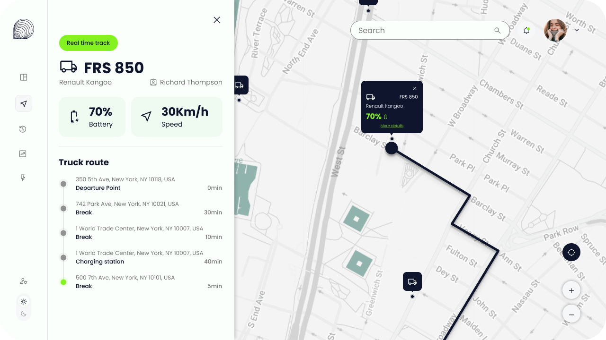

# Dashboard Truck Tracking (Mock)
This mini-project is a quick and practical exercise where I integrated a simple truck tracking interface (see screenshot below). The main goal was to connect a clean Vue.js front-end with an API mock generated using SwaggerHub.  
The idea behind this small app is to showcase how to set up HTTP requests, handle mock data, and structure a front-end project in a straightforward and efficient way. 




## :computer: Tech Stack
- **Framework:** Vue.js (TypeScript + SASS)  
- **Libraries:** Leaflet (for map integration)  
- **Bundle & Dev Server:** Vite 


## :pushpin: API URL Requests  
Use the following endpoints to retrieve the data:  

- **Get Vehicle:** https://virtserver.swaggerhub.com/karolgiraldo-d5d/TruckTrackingAPI/1.0.0/vehicles/FRS850  
- **Get Location:** https://virtserver.swaggerhub.com/karolgiraldo-d5d/TruckTrackingAPI/1.0.0/vehicles/FRS850/location  
- **Get Route:** https://virtserver.swaggerhub.com/karolgiraldo-d5d/TruckTrackingAPI/1.0.0/vehicles/FRS850/route
**Heads-up:** the SwaggerHub mock server will vanish after 30 days because of the trial plan.


## :open_file_folder: Structure
```txt
src/
|── App.vue                    👈 Vue principal
|── leaflet-fix.ts	       👈 Patch to leaflet library to configurate the map icons (find the good path for markers)
|── shims-vue.d                👈 Help TS to understand Vue to avoid errors
|
│── components/
│   ├── Chip.vue	        👈 Show the status
│   ├── InfoCard.vue            👈 Show important information -> Battery level / Speed / etc
|   ├── LinkMenu.vue            👈 As its name suggests, it represents the menu options (on the left side).
|   ├── Map.vue 		👈 Show the map
|   ├── Menu.vue		
|   ├── Noification.vue		👈 Handles the display of notifications.
|   ├── PanelLocation.vue	👈 Show all the information of a route.
|   ├── SearchBar.vue
|   ├── ToggleBtn.vue		
│
│── fonts/                      
|
|── images/                      👈 Save static images and icons 
│   ├── icons/
|
│── models/                      👈 App Data representation type 
│   ├── Vehicule.ts             
│   ├── Stop.ts             
|   ├── Route.ts          
|   ├── Location.ts
|   ├── Driver.ts
|   ├── Coordinates.ts
|   ├── Battery.ts
|
│── services/                   👈 Group API Logic
│   ├── vehicleService.ts        
|
|── styles/                    
│   ├── main.scss               👈 Styles globales
│   ├── mixins.scss             👈 Mixins pour la gestions des pictos / Init de la police
|   ├── config.scss             👈 Variables globales
|
│── index.html
│── main.js
```

## :page_with_curl: Instalation
```bash
git clone 
npm install
npm run dev
```
